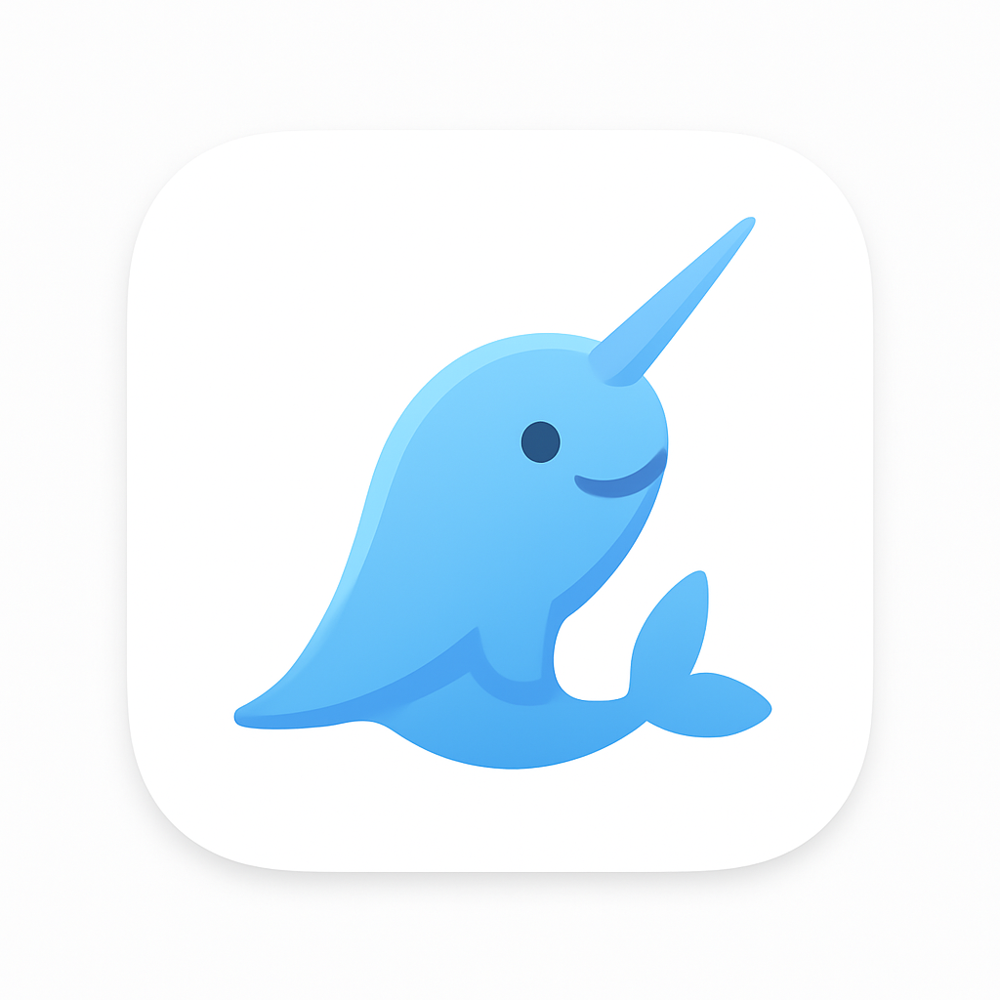
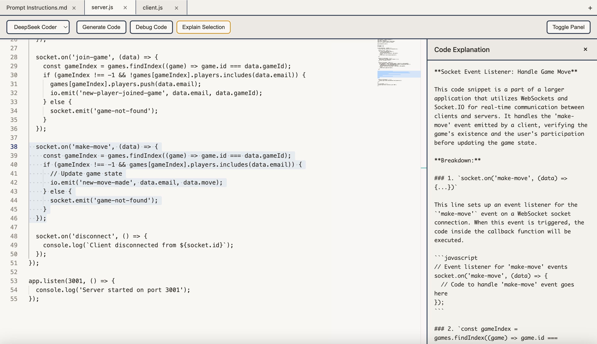

# 🦄 NarwhAI - Local AI Code Editor

<p align="center">
  
</p>

<p align="center">
  A privacy-focused code editor with local AI assistance powered by Ollama and Monaco Editor
</p>

<p align="center">
  
  
  
  
</p>

## ✨ Features

- **🔒 100% Local & Private** - Your code never leaves your machine
- **🤖 AI-Powered Assistance** - Generate, debug, and explain code using local LLMs
- **📑 Multi-Tab Interface** - Work with multiple files simultaneously
- **🎨 Claude-Inspired Design** - Clean, modern UI with beige/aqua/blue color scheme
- **🚀 Auto-Starts Ollama** - No manual terminal commands needed
- **💾 Smart File Management** - Proper save/save-as functionality with visual indicators
- **⚡ Monaco Editor** - Industry-standard code editor (same as VS Code)

## 📸 Screenshots

<p align="center">
  
</p>
<p align="center"><em>Main editor interface with AI panel and multi-tab support</em></p>

## 🚀 Quick Start

### Prerequisites

1. **Node.js** (v16 or higher) - [Download](https://nodejs.org/)
2. **Ollama** - [Download](https://ollama.ai/)

### Installation

```bash
# Clone the repository
git clone https://github.com/yourusername/narwhai.git
cd narwhai

# Install dependencies
npm install

# Start the application
npm start
```

### First Run Setup

On first launch, NarwhAI will automatically start Ollama. You'll need to install at least one model:

```bash
# Recommended models (choose one or more)
ollama pull deepseek-coder:6.7b  # Best for coding
ollama pull llama3.2:3b          # Lightweight & fast
ollama pull deepseek-r1:7b        # Advanced reasoning
```

## ⌨️ Keyboard Shortcuts

| Action | macOS | Windows/Linux |
|--------|-------|---------------|
| New Tab | `⌘ T` | `Ctrl+T` |
| Close Tab | `⌘ W` | `Ctrl+W` |
| Open File | `⌘ O` | `Ctrl+O` |
| Save | `⌘ S` | `Ctrl+S` |
| Save As | `⌘ ⇧ S` | `Ctrl+Shift+S` |
| Generate Code | `⌘ G` | `Ctrl+G` |
| Debug Code | `⌘ D` | `Ctrl+D` |
| Explain Selection | `⌘ E` | `Ctrl+E` |

## 🎯 Features in Detail

### AI Capabilities

- **Generate Code**: Create code from scratch or enhance existing code
- **Debug Analysis**: Identify bugs and get improvement suggestions
- **Explain Selection**: Get detailed explanations of selected code snippets

### Tab System

- Visual indicators for unsaved changes (• dot)
- Confirmation prompts for closing unsaved files
- Each tab maintains its own file path and state
- Automatic language detection based on file extension

### Supported Languages

JavaScript, TypeScript, Python, HTML, CSS, JSON, Markdown, YAML, and more - full Monaco Editor language support.

## 🔧 Configuration

### Adding More Models

Edit `index.html` to add more Ollama models to the dropdown:

```html
<select id="model-select">
    <option value="deepseek-coder:6.7b">DeepSeek Coder</option>
    <option value="llama3.2:3b">Llama 3.2</option>
    <option value="deepseek-r1:7b">DeepSeek R1</option>
    <!-- Add your models here -->
    <option value="codellama:7b">CodeLlama</option>
</select>
```

## 🏗️ Building for Distribution

### macOS
```bash
npm run build-mac
# Creates .dmg in dist/ folder
```

### Windows
```bash
npm run build-win
# Creates installer in dist/ folder
```

## 📁 Project Structure

```
narwhai/
├── main.js              # Electron main process
├── preload.js           # Secure IPC bridge
├── renderer.js          # UI and Monaco integration
├── index.html           # Application interface
├── package.json         # Dependencies & configuration
├── build/
│   └── icons/          # Application icons
│       ├── icon.png    # Linux/dev icon
│       ├── icon.icns   # macOS icon
│       └── icon.ico    # Windows icon
└── node_modules/        # Dependencies (git-ignored)
```

## 🤝 Contributing

Contributions are welcome! Please feel free to submit a Pull Request.

1. Fork the repository
2. Create your feature branch (`git checkout -b feature/AmazingFeature`)
3. Commit your changes (`git commit -m 'Add some AmazingFeature'`)
4. Push to the branch (`git push origin feature/AmazingFeature`)
5. Open a Pull Request

## 📄 License

This project is licensed under the MIT License - see the [LICENSE](LICENSE) file for details.

## 🙏 Acknowledgments

- [Monaco Editor](https://microsoft.github.io/monaco-editor/) - The powerful code editor
- [Electron](https://www.electronjs.org/) - Cross-platform desktop framework
- [Ollama](https://ollama.ai/) - Local LLM inference engine
- [DeepSeek](https://www.deepseek.com/) - For the excellent coding models
- Inspired by Claude's elegant design philosophy

## ⚠️ Disclaimer

NarwhAI is an independent project and is not affiliated with Ollama, Microsoft (Monaco), DeepSeek, or Anthropic. This is a community-driven, open-source tool that interfaces with these technologies.

## 🐛 Known Issues

- Ollama must be installed separately before first use
- Some models require significant RAM (8GB+ recommended)
- Auto-start of Ollama may fail if not in system PATH

## 📮 Support

For issues, questions, or suggestions, please open an issue on GitHub.

---

<p align="center">
  Made with 🦄 and local AI
</p>
